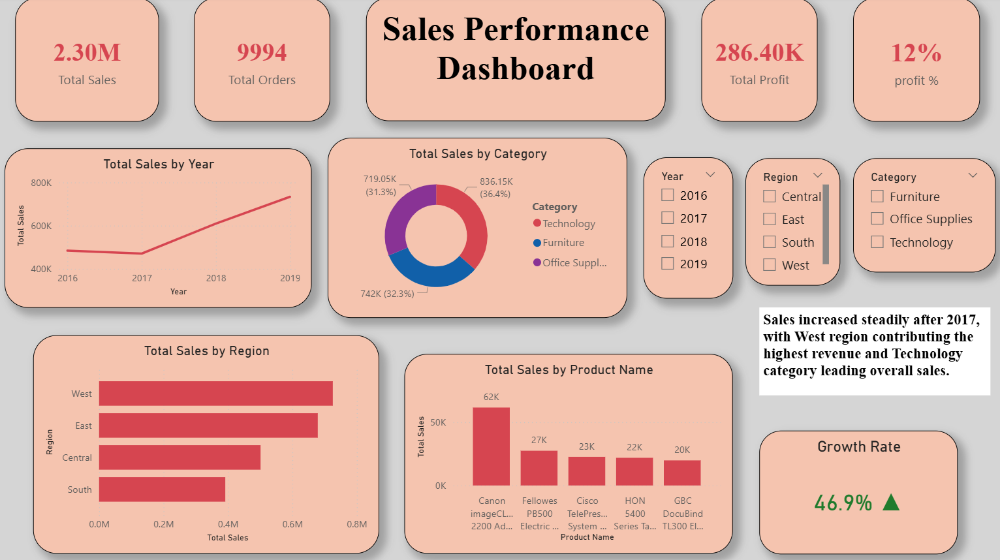

# Sales Performance Dashboard

## Project Overview
This Power BI dashboard provides a comprehensive analysis of sales performance across different years, regions, categories, and products. The dashboard helps identify sales trends, profit growth, and high-performing business areas.

## Tools Used
- Power BI
- DAX
- Excel

## Dashboard Features
- KPI Cards for Sales, Orders, Profit, and Profit Percentage
- Sales Trend Analysis by Year
- Category-wise Sales Analysis
- Regional Performance Analysis
- Product-wise Sales Comparison
- Interactive Filters and Slicers
- Growth Rate Analysis

## Key Insights
- Sales increased steadily after 2017.
- West region generated the highest revenue.
- Technology category contributed the highest sales.
- Overall growth rate reached 46.9%.

## Files Included
- sales dashboard project.pbix
- sales_dashboard.png

## Dashboard Screenshot

